# Emlak Portföy Yönetim Sistemi

## Uygulama Planı ve Görev Listesi

Bu doküman, projenin tüm modüllerini, geliştirme sırasını ve önemli teknik/fonksiyonel gereksinimleri kapsamaktadır. Her modülün sonunda test, seed ve dokümantasyon adımlarını unutmayınız. Gereksinimler ve modüller arası ilişkiler aşağıda detaylı şekilde sıralanmıştır.


# Kapsamlı Gereksinim ve Uygulama Planı

## 1. Giriş

Bu sistem, emlak profesyonellerinin portföy, müşteri, mülk, ilan, randevu ve dokümantasyon süreçlerini uçtan uca yönetmesini sağlar. Modern, ölçeklenebilir ve güvenli bir mimari hedeflenmiştir.  
**Teknolojiler:** Laravel, MySQL, Livewire, Alpine.js, TailwindCSS  
**Dil:** Tamamen Türkçe arayüz  
**Veri Modeli:** UUID tabanlı, soft delete destekli, Türkçe alan adları

---

## 2. Temel Sistem Altyapısı

### 2.1. Veri Tabanı ve Model Standartları
- UUID Primary Key, soft delete, timestamp alanları (olusturma_tarihi, guncelleme_tarihi, silinme_tarihi)
- Türkçe alan adları, tüm ilişkilerde UUID foreign key
- Veri bütünlüğü, backup/restore desteği

### 2.2. Ortak Model ve Helper Sınıfları
- BaseModel: UUID, soft delete, timestamp, ortak metodlar
- Helper Sınıflar: UUID üretimi, tarih formatlama, dosya yükleme, validasyon

---

## 3. Organizasyon ve Kullanıcı Yönetimi

### 3.1. Organizasyon Yapısı
- Şube, Departman, Pozisyon, PersonelRolu, Personel tabloları
- Personel: Kişisel bilgiler, iletişim, iş bilgileri, departman, şube, pozisyon, roller (many-to-many)
- Kişi: Tüm sistemde temel kişi bilgisi (ad, soyad, iletişim, adres, notlar)
- User: Personel eklenince otomatik oluşturulur, şifre olarak TC no atanır
- Rol ve Yetki: Spatie/Laravel-Permission, UUID desteği, default roller
- Audit Log: Tüm kritik işlemler, kullanıcı aktiviteleri, şüpheli aktivite tespiti

### 3.2. Kullanıcı, Rol,İzin ve Profil Yönetimi
- Profil resmi yükleme, varsayılan avatar
- Son giriş zamanı, aktif oturumlar, IP loglama
- Personel ayrıldığında soft delete
- Spatie Laravel-Permission düzenlememeleri

---

## 4. Lokasyon Yönetimi
- Şehir, İlçe, Semt, Mahalle: UUID, soft delete, hiyerarşik ilişkiler
- Şube: Lokasyon ile ilişkili, yöneticisi personel
- Hiyerarşik Seçim Componenti: Şehir > İlçe > Semt > Mahalle zincirleme seçim, dinamik güncelleme
- Koordinat Bilgisi: Mahalle ve şube için koordinat_x, koordinat_y

---

## 5. Standart Form ve UI Bileşenleri
- Input, Select, Toggle, Checkbox, Radio, File Upload, Dropzone: Mask, currency, error, açıklama, label pozisyonu, icon desteği, boyut seçenekleri, dosya validasyonu
- Modal Component: Açma/kapama, onay, nested modal, z-index, klavye kısayolları
- DataTable Component: Sıralama, filtreleme, arama, sütun yönetimi, export, sayfalama

---

## 6. Mülk Yönetimi
- Mülk Türleri, Durumları, Özellikleri: Kategorik ve dinamik alanlar
- Mülk: Ana tablo, sahip (kisi), sorumlu personel, mahalle, fiyat, metrekare, oda/banyo/kat bilgileri, tapu, aidat, site, adres, koordinat, durum, notlar
- Mülk Özellik Değerleri: Her mülk için dinamik özellikler (ör: oda sayısı, balkon var mı, vb.)
- CRUD ve Sihirbaz: Çok adımlı form, taslak kaydetme, doğrulama, otomatik portföy numarası

---

## 7. Müşteri ve Mülk Sahibi Yönetimi
- Kişi: Mülk sahibi, müşteri, her ikisi
- Müşteri: Talep, bütçe, tercih edilen lokasyon, oda/metrekare aralığı, özel istekler, durum, iletişim geçmişi
- Müşteri-Mülk İlişkisi: Hangi müşteri hangi mülkle ilgileniyor, teklif, ilgi durumu, notlar

---

## 8. Etkileşim ve Görüşme Takibi
- Müşteri-Mülk Etkileşim: Sunum, teklif, ziyaret, ilgi durumu, geçmiş
- Görüşme: Tarih, konu, sonuç, sonraki adım, müşteri durumu güncelleme, müşteri takip raporu

---

## 9. Talep Yönetimi
- Müşteri Talep: Çoklu mülk tipi, çoklu lokasyon, fiyat aralığı, satılık/kiralık, bildirim sistemi

---

## 10. Platform Entegrasyonu ve İlan Yönetimi
- İlan Platformları: Sahibinden, Hürriyet Emlak, Hepsiemlak, Kendi Sitesi, İlansız
- İlan: Mülk ile ilişkili, başlık, açıklama, ilan no, fiyat, durum, SEO, sorumlu personel, notlar
- İlan-Platform İlişkisi: Her platform için ID, link, durum, hata mesajı, maliyet, görüntülenme
- API Entegrasyonları: Platform API bilgileri, hata yönetimi, loglama

---

## 11. Randevu ve Takvim Yönetimi
- Randevu: Müşteri, mülk, personel, başlık, açıklama, tarih, saat, durum, sonuç, müşteri geri bildirim, sonraki adım, hatırlatma, lokasyon, notlar
- Bildirim Sistemi: E-posta, uygulama içi, push notification

---

## 12. Medya, Galeri ve Dokümantasyon

- [ ] **Mülk Medya**
  - Galeri, özel fotoğraf kategorileri, arsa için dokümantasyon, eski resim arşivleme

- [ ] **Doküman Yönetimi**
  - Tapu, AutoCAD, PDF, DWG, DXF, güvenli indirme

- [ ] **Test, seed, dokümantasyon**

---

## 13. Fiyat Takibi ve Analiz
- Fiyat Geçmişi: Mülk, eski/yeni fiyat, değişiklik tarihi, nedeni, personel, notlar
- Analiz: Bölgesel fiyat trendi, benzer mülk karşılaştırma, fiyat anomalisi tespiti

---

## 14. Gelişmiş Arama ve Filtreleme
- Çoklu kriter, harita entegrasyonu (Google Maps), kayıtlı arama, AI öneri sistemi, export

---

## 15. Raporlama ve Export
- PDF, XLSX, sunum dosyası, toplu sunum, indirme linki

---

## 16. Dashboard ve İstatistik
- Genel ve bireysel performans, bölgesel analiz, zaman bazlı rapor, finansal rapor, komisyon hesaplama

---

## 17. Mobil Uyumluluk ve PWA
- Responsive tasarım, kamera/GPS entegrasyonu, offline çalışma, PWA, push bildirim

---

## 18. Layout ve Navigasyon
- Sidebar, içerik genişleme, kullanıcı tercihi, responsive navigasyon

---

## 19. Test, Optimizasyon ve Performans
- Birim, entegrasyon, fonksiyonel testler
- Veritabanı ve frontend optimizasyonu, önbellek stratejisi
- Asset minifikasyonu, lazy loading, code splitting
- Log ve hata izleme (Sentry, Bugsnag)
- Geliştirici dokümantasyonu

---

## 20. Ek Teknik Detaylar ve İyileştirmeler
- KVKK ve Kullanıcı Sözleşmesi: Kayıt ve profilde zorunlu onay kutuları
- Çoklu Dil Altyapısı: Şimdilik Türkçe, altyapı çoklu dil için uygun
- Seed ve Demo Data: Geliştirme ve test için örnek veri setleri
- API Layer: Gerekirse mobil uygulama veya entegrasyonlar için REST/GraphQL API
- Veri Yedekleme ve Restore: UUID uyumlu, manuel/otomatik yedekleme
- Kullanıcı Aktivite Takibi: Son giriş zamanı, aktif oturumlar, IP loglama
- Bildirim Sistemi: E-posta, uygulama içi, push notification
- Log ve Hata İzleme: Sentry, Bugsnag gibi servislerle entegrasyon

---

## 21. Migration ve Veri Modeli Özetleri

### Lokasyon
- sehirler, ilceler, semtler, mahalleler (UUID, ad, kodlar, aktiflik, not, sıralama, koordinat, soft delete, timestamp)
- hiyerarşik foreign key'ler

### Organizasyon
- subeler, departmanlar, personel, personel_rolu, pozisyonlar (UUID, ad, açıklama, yöneticiler, ilişkiler, soft delete, timestamp)
- personel: kisi_id, user_id, sube_id, departman_id, sicil_no, iş bilgileri

### Mülk
- mulk_turleri, mulk_durumlari, mulk_ozellikleri, mulkler, mulk_ozellik_degerleri (UUID, ad, açıklama, tip, seçenekler, fiyat, metrekare, oda, banyo, tapu, site, adres, koordinat, durum, notlar, soft delete, timestamp)
- dinamik özellikler için ayrı tablo

### Müşteri
- kisi, musteriler, musteri_mulk_iliskileri (UUID, ad, soyad, iletişim, adres, notlar, müşteri tipi, talep, bütçe, tercih edilen lokasyon, durum, notlar, soft delete, timestamp)

### Medya & Doküman
- medya_turleri, medyalar, dokuman_turleri, dokumanlar (UUID, ad, mime, dosya, polimorfik ilişki, ana görsel, sıralama, yükleyen, soft delete, timestamp)

### İlan
- ilan_platformlari, ilanlar, ilan_platform_iliskileri (UUID, ad, website, api, açıklama, ilan no, fiyat, durum, SEO, sorumlu personel, notlar, soft delete, timestamp)

### Randevu
- randevu (UUID, musteri_id, mulk_id, personel_id, başlık, açıklama, tarih, saat, durum, sonuç, müşteri geri bildirim, sonraki adım, hatırlatma, lokasyon, notlar, soft delete, timestamp)

### Fiyat Geçmişi
- fiyat_gecmisi (UUID, mulk_id, eski/yeni fiyat, değişiklik tarihi, nedeni, personel, notlar, soft delete, timestamp)

---

## 22. Modüller Arası İlişkiler
- Kişi: Personel, müşteri, mülk sahibi, kullanıcıya temel veri sağlar
- Personel: Organizasyon, kullanıcı, şube, departman, rol ile ilişkili
- Mülk: Lokasyon, sahip (kisi), sorumlu personel, müşteri, ilan, medya, doküman ile ilişkili
- Müşteri: Kişi, mülk, randevu, talep, etkileşim, görüşme ile ilişkili
- İlan: Mülk, platform, medya, doküman ile ilişkili
- Randevu: Müşteri, mülk, personel ile ilişkili
- Medya/Doküman: Polimorfik olarak mülk, ilan, müşteri, personel ile ilişkili

---

## 23. Geliştirme ve Test Stratejisi
- Her modül için: migration, model, repository, servis, controller, blade/livewire component, test, seed, dokümantasyon
- Her modülün sonunda: test, seed, dokümantasyon adımlarını unutma
- Bildirim, log, API, KVKK, çoklu dil gibi altyapı gereksinimlerini modüller arası ortak olarak planla
- Geliştirme sırasında yeni gereksinimler çıktıkça bu yapıyı kolayca genişletebilirsin

---

## Standart Form ve UI Bileşenleri Modülü - Detay Breakdown

### 1. Amaç ve Kapsam
Bu modül, sistem genelinde kullanılacak tüm form ve arayüz bileşenlerinin (input, select, toggle, radio, checkbox, file upload, dropzone, modal, datatable) standart, yeniden kullanılabilir ve özelleştirilebilir şekilde geliştirilmesini sağlar.

### 2. Temel Bileşenler ve Özellikler

#### Input Bileşenleri
- Text, date, number, currency, phone, identify, search
- Mask desteği (ör: telefon, TC kimlik)
- Currency input: Sağ/sol etiket, para birimi seçimi
- Error mesajı: Kırmızı küçük yazı
- Açıklama etiketi
- Required alanlarda otomatik * işareti
- Label pozisyonu: left/top
- Icon desteği: Fontawesome, sağ/sol opsiyonel
- Boyut: xs, sm, md, lg, 2xl (label ve text birlikte büyür)

#### Seçim Bileşenleri
- Select (arama özellikli), toggle, radio, checkbox
- Select: Arama opsiyonel, dinamik veri kaynağı
- Toggle: Açık/kapalı, renkli durum
- Radio/Checkbox: Grup desteği, inline/stacked

#### Dosya Yükleme Bileşenleri
- File upload: Tekli/çoklu dosya, dosya tipi ve boyut validasyonu
- Dropzone: Sürükle-bırak, image preview, progress bar

#### Modal Bileşeni
- Açma/kapama, onay isteme, nested modal, z-index yönetimi, ESC ile kapama
- Modal dışına tıklamada onay

#### DataTable Bileşeni
- Sıralama, filtreleme, arama, sütun yönetimi (gizle/göster, drag & drop), export (PDF, XLSX, CSV), sayfalama

### 3. İlişkiler ve Kullanım
- Tüm Livewire/Blade formlarında bu bileşenler kullanılacak
- DataTable, Modal ve Form bileşenleri birbiriyle entegre çalışacak
- Dosya yükleme bileşenleri medya/doküman modülleriyle entegre

### 4. Fonksiyonel Özellikler
- Tüm bileşenler için props ile özelleştirme
- Alpine.js ile dinamik davranışlar
- TailwindCSS ile responsive ve tema desteği
- Validasyon ve hata yönetimi
- Erişilebilirlik (a11y) desteği

### 5. Örnek Blade Component Kullanımı
```blade
<x-form.input name="ad" label="Ad" required size="md" icon="user" icon-position="left" description="Kullanıcı adı giriniz" />
<x-form.select name="sehir_id" :options="$sehirler" searchable label="Şehir" />
<x-form.file-upload name="dosya" label="Dosya Yükle" accept=".pdf,.jpg" multiple />
<x-modal title="Kayıt Ekle" :show="$showModal">
    ...
</x-modal>
<x-datatable :columns="$columns" :data="$data" exportable sortable filterable />
```

### 6. ER Diyagramı (Bileşenler Arası İlişki)
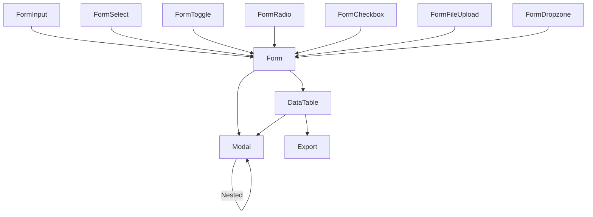

### 7. Test ve Seed
- Her bileşen için birim ve entegrasyon testleri (Livewire, Blade)
- Demo sayfaları ve örnek seed verileri

### 8. Geliştirme Notları
- Bileşenler Blade component olarak yazılmalı, Livewire ile dinamikleştirilmeli
- Alpine.js ile animasyon ve etkileşimler güçlendirilmeli
- Tüm bileşenler için tema ve renk desteği (ör: amber-300, amber-400)
- Erişilebilirlik ve responsive tasarım öncelikli

---

## Mülk Yönetimi Modülü - Detay Breakdown

### 1. Amaç ve Kapsam
Mülk yönetimi modülü, portföydeki tüm mülklerin (konut, arsa, işyeri, turistik tesis vb.) detaylı ve dinamik olarak yönetilmesini sağlar. Kategorik yapı, dinamik özellikler, sahiplik, lokasyon, fiyat, durum ve portföy numarası gibi tüm temel bilgiler bu modülde tutulur.

### 2. Temel Tablolar ve Alanlar

#### mulk_turleri
- id (uuid, primary)
- ad (string)
- aciklama (text, nullable)
- aktif_mi (boolean)
- siralama (integer)
- olusturma_tarihi, guncelleme_tarihi, silinme_tarihi (timestamp)

#### mulk_durumlari
- id (uuid, primary)
- ad (string)
- aciklama (text, nullable)
- aktif_mi (boolean)
- siralama (integer)
- olusturma_tarihi, guncelleme_tarihi, silinme_tarihi (timestamp)

#### mulk_ozellikleri
- id (uuid, primary)
- ad (string)
- kategori (string, nullable)
- tip (enum: Sayısal, Evet/Hayır, Metin, Seçim)
- secenekler (text, JSON, nullable)
- aciklama (text, nullable)
- aktif_mi (boolean)
- siralama (integer)
- olusturma_tarihi, guncelleme_tarihi, silinme_tarihi (timestamp)

#### mulkler
- id (uuid, primary)
- mulk_turu_id (uuid, foreign, mulk_turleri)
- mulk_durumu_id (uuid, foreign, mulk_durumlari)
- sahip_id (uuid, foreign, kisi, nullable)
- baslik (string)
- aciklama (text, nullable)
- referans_no (string, unique)
- fiyat (decimal)
- para_birimi (string, default 'TRY')
- pazarlik_payi_var_mi (boolean)
- metrekare (decimal, nullable)
- oda_sayisi, salon_sayisi, banyo_sayisi, tuvalet_sayisi, kat_sayisi, bulundugu_kat, bina_yasi (integer, nullable)
- isitma_tipi (string, nullable)
- mobilyali_mi, site_icerisinde_mi (boolean)
- site_adi (string, nullable)
- aidat (decimal, nullable)
- aidat_para_birimi (string, default 'TRY')
- tapu_durumu, kullanim_durumu (string, nullable)
- satis_tarihi, kiralama_tarihi, kiralama_bitis_tarihi (date, nullable)
- mahalle_id (uuid, foreign, mahalleler, nullable)
- adres (string, nullable)
- posta_kodu (string, nullable)
- koordinat_x, koordinat_y (decimal, nullable)
- notlar (text, nullable)
- durum (enum: Aktif, Satıldı, Kiralandı, Pasif)
- sorumlu_personel_id (uuid, foreign, personel, nullable)
- olusturma_tarihi, guncelleme_tarihi, silinme_tarihi (timestamp)

#### mulk_ozellik_degerleri
- id (uuid, primary)
- mulk_id (uuid, foreign, mulkler)
- ozellik_id (uuid, foreign, mulk_ozellikleri)
- deger (string, nullable)
- olusturma_tarihi, guncelleme_tarihi, silinme_tarihi (timestamp)
- unique: [mulk_id, ozellik_id]

### 3. İlişkiler
- Mülk > Mülk Türü, Mülk Durumu, Mahalle, Sahip (Kişi), Sorumlu Personel
- Mülk > Mülk Özellik Değerleri (her mülk için dinamik özellikler)
- Mülk Özellik Değerleri > Mülk Özellikleri

### 4. Fonksiyonel Özellikler
- CRUD işlemleri (mülk, tür, durum, özellik, dinamik değerler)
- Çok adımlı mülk ekleme sihirbazı (kategori, alt kategori, lokasyon, özellikler, fiyat, medya, doküman, özet)
- Otomatik portföy/referans numarası üretimi
- Dinamik form alanları (kategoriye göre değişen)
- Hiyerarşik lokasyon seçimi
- Soft delete ve UUID desteği
- Sıralama ve aktiflik yönetimi
- Not ve açıklama alanları

### 5. Örnek Migration (Kısaltılmış)
```php
Schema::create('mulkler', function (Blueprint $table) {
    $table->uuid('id')->primary();
    $table->uuid('mulk_turu_id');
    $table->uuid('mulk_durumu_id');
    $table->uuid('sahip_id')->nullable();
    $table->string('baslik');
    $table->text('aciklama')->nullable();
    $table->string('referans_no')->unique();
    $table->decimal('fiyat', 15, 2);
    $table->string('para_birimi', 3)->default('TRY');
    // ... diğer alanlar ...
    $table->timestamp('olusturma_tarihi')->nullable();
    $table->timestamp('guncelleme_tarihi')->nullable();
    $table->timestamp('silinme_tarihi')->nullable();
    $table->foreign('mulk_turu_id')->references('id')->on('mulk_turleri');
    $table->foreign('mulk_durumu_id')->references('id')->on('mulk_durumlari');
    $table->foreign('sahip_id')->references('id')->on('kisi');
});
```

### 6. ER Diyagramı (Mermaid)
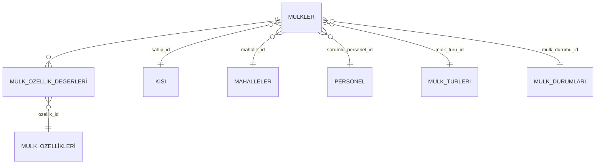

### 7. Test ve Seed
- Her tablo için örnek seed dosyası (örnek tür, durum, özellik, mülk, dinamik değer)
- CRUD, dinamik form ve sihirbaz için birim testleri

### 8. Geliştirme Notları
- Çok adımlı form Livewire ile geliştirilmeli, adımlar arası geçişte veri kaybı olmamalı
- Dinamik özellikler için JSON veya ayrı tablo kullanılmalı (tercihen ayrı tablo)
- Otomatik referans numarası için helper fonksiyon
- Hiyerarşik lokasyon seçimi zorunlu
- Soft delete ile silinen kayıtlar arayüzde filtrelenebilir olmalı

---

## Müşteri ve Mülk Sahibi Yönetimi Modülü - Detay Breakdown

### 1. Amaç ve Kapsam
Bu modül, sistemdeki tüm kişiler (müşteri, mülk sahibi, her ikisi) ile ilgili temel bilgilerin, taleplerin, ilgilendiği mülklerin ve iletişim geçmişinin yönetilmesini sağlar. Müşteri-mülk ilişkisi, talepler ve iletişim notları bu modülün temelini oluşturur.

### 2. Temel Tablolar ve Alanlar

#### kisi
- id (uuid, primary)
- ad (string)
- soyad (string)
- email (string, nullable)
- telefon (string, nullable)
- adres (string, nullable)
- notlar (text, nullable)
- aktif_mi (boolean)
- olusturma_tarihi, guncelleme_tarihi, silinme_tarihi (timestamp)

#### musteriler
- id (uuid, primary)
- kisi_id (uuid, foreign, kisi)
- musteri_tipi (enum: Alıcı, Satıcı, Kiracı, Ev Sahibi, Potansiyel, Diğer)
- referans_no (string, unique)
- sorumlu_personel_id (uuid, foreign, personel, nullable)
- talep_detaylari (text, nullable)
- butce_min, butce_max (decimal, nullable)
- para_birimi (string, default 'TRY')
- tercih_edilen_sehir_id, ilce_id, semt_id, mahalle_id (uuid, foreign, nullable)
- tercih_edilen_oda_sayisi_min, max (integer, nullable)
- tercih_edilen_metrekare_min, max (decimal, nullable)
- ozel_istekler (text, nullable)
- durum (enum: Aktif, Pasif, Tamamlandı, İptal)
- son_iletisim_tarihi (date, nullable)
- son_iletisim_notu (text, nullable)
- sonraki_iletisim_tarihi (date, nullable)
- notlar (text, nullable)
- olusturma_tarihi, guncelleme_tarihi, silinme_tarihi (timestamp)

#### musteri_mulk_iliskileri
- id (uuid, primary)
- musteri_id (uuid, foreign, musteriler)
- mulk_id (uuid, foreign, mulkler)
- ilgi_durumu (enum: İlgileniyor, Görüntüledi, Ziyaret Etti, Teklif Verdi, Vazgeçti, Satın Aldı, Kiraladı)
- teklif_edilen_fiyat (decimal, nullable)
- para_birimi (string, default 'TRY')
- teklif_tarihi (date, nullable)
- notlar (text, nullable)
- olusturma_tarihi, guncelleme_tarihi, silinme_tarihi (timestamp)
- unique: [musteri_id, mulk_id]

### 3. İlişkiler
- Müşteri > Kişi (her müşteri bir kişiye bağlı)
- Müşteri > Sorumlu Personel
- Müşteri > Tercih edilen lokasyonlar (şehir, ilçe, semt, mahalle)
- Müşteri-Mülk İlişkisi: Hangi müşteri hangi mülkle ilgileniyor, teklif, ilgi durumu
- Müşteri > Müşteri-Mülk İlişkileri (one-to-many)

### 4. Fonksiyonel Özellikler
- CRUD işlemleri (kişi, müşteri, müşteri-mülk ilişkisi)
- Kişi tipi seçimi (müşteri, mülk sahibi, her ikisi)
- Mülk sahibi-mülk ve müşteri-mülk tipi ilişkileri
- Talep, bütçe, tercih edilen lokasyon, özel istekler yönetimi
- İletişim geçmişi ve notlar
- Soft delete ve UUID desteği
- Sıralama ve aktiflik yönetimi

### 5. Örnek Migration (Kısaltılmış)
```php
Schema::create('kisi', function (Blueprint $table) {
    $table->uuid('id')->primary();
    $table->string('ad');
    $table->string('soyad');
    $table->string('email')->nullable();
    $table->string('telefon')->nullable();
    $table->string('adres')->nullable();
    $table->text('notlar')->nullable();
    $table->boolean('aktif_mi')->default(true);
    $table->timestamp('olusturma_tarihi')->nullable();
    $table->timestamp('guncelleme_tarihi')->nullable();
    $table->timestamp('silinme_tarihi')->nullable();
});
```

### 6. ER Diyagramı (Mermaid)
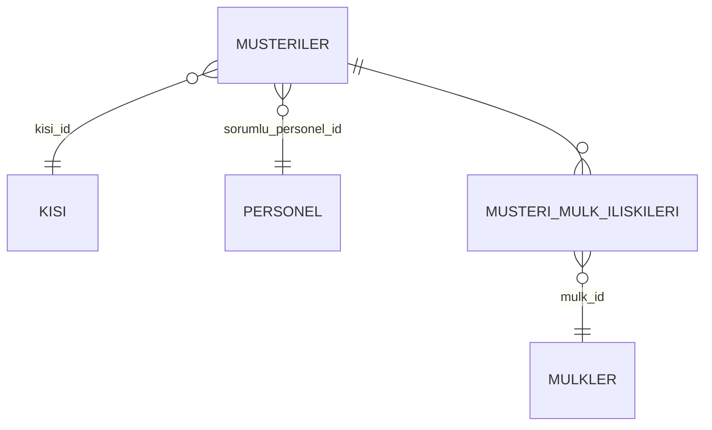

### 7. Test ve Seed
- Her tablo için örnek seed dosyası (örnek kişi, müşteri, müşteri-mülk ilişkisi)
- CRUD ve ilişki yönetimi için birim testleri

### 8. Geliştirme Notları
- Kişi tipi seçimi ile dinamik form alanları
- Müşteri-mülk ilişkisi için pivot tablo ve ilgi durumu yönetimi
- Talep ve iletişim geçmişi için ayrı modüllerle entegrasyon
- Soft delete ile silinen kayıtlar arayüzde filtrelenebilir olmalı

---

## Etkileşim ve Görüşme Takibi Modülü - Detay Breakdown

### 1. Amaç ve Kapsam
Bu modül, müşterilerle yapılan tüm mülk etkileşimlerinin (gösterim, teklif, ziyaret, sunum) ve müşteriyle yapılan görüşmelerin detaylı şekilde kaydını ve takibini sağlar. Müşteri ilişkileri yönetimi ve satış süreci izlenebilirliği için kritik önemdedir.

### 2. Temel Tablolar ve Alanlar

#### musteri_mulk_iliskileri (önceki modülde tanımlandı)
- id (uuid, primary)
- musteri_id (uuid, foreign, musteriler)
- mulk_id (uuid, foreign, mulkler)
- ilgi_durumu (enum: İlgileniyor, Görüntüledi, Ziyaret Etti, Teklif Verdi, Vazgeçti, Satın Aldı, Kiraladı)
- teklif_edilen_fiyat (decimal, nullable)
- para_birimi (string, default 'TRY')
- teklif_tarihi (date, nullable)
- notlar (text, nullable)
- olusturma_tarihi, guncelleme_tarihi, silinme_tarihi (timestamp)

#### musteri_gorusmeler
- id (uuid, primary)
- musteri_id (uuid, foreign, musteriler)
- personel_id (uuid, foreign, personel)
- tarih (date)
- konu (string)
- sonuc (string, nullable)
- sonraki_adim (string, nullable)
- sonraki_adim_tarihi (date, nullable)
- notlar (text, nullable)
- durum (enum: Planlandı, Tamamlandı, İptal, Ertelendi)
- olusturma_tarihi, guncelleme_tarihi, silinme_tarihi (timestamp)

### 3. İlişkiler
- Müşteri-Mülk Etkileşim: musteri_mulk_iliskileri tablosu ile (müşteri <-> mülk, ilgi durumu, teklif, notlar)
- Müşteri-Görüşme: musteri_gorusmeler tablosu ile (müşteri <-> personel, tarih, konu, sonuç, sonraki adım)
- Müşteri > musteri_gorusmeler (one-to-many)

### 4. Fonksiyonel Özellikler
- CRUD işlemleri (etkileşim, görüşme)
- Müşteri detayında tüm etkileşim ve görüşmelerin kronolojik listesi
- Modal pencerede görüşme geçmişi
- Görüşme ekleme, düzenleme, silme
- Görüşme sonucuna göre müşteri durumunun otomatik güncellenmesi
- Sunum ve aktivite geçmişi takibi
- Soft delete ve UUID desteği

### 5. Örnek Migration (Kısaltılmış)
```php
Schema::create('musteri_gorusmeler', function (Blueprint $table) {
    $table->uuid('id')->primary();
    $table->uuid('musteri_id');
    $table->uuid('personel_id');
    $table->date('tarih');
    $table->string('konu');
    $table->string('sonuc')->nullable();
    $table->string('sonraki_adim')->nullable();
    $table->date('sonraki_adim_tarihi')->nullable();
    $table->text('notlar')->nullable();
    $table->enum('durum', ['Planlandı', 'Tamamlandı', 'İptal', 'Ertelendi'])->default('Planlandı');
    $table->timestamp('olusturma_tarihi')->nullable();
    $table->timestamp('guncelleme_tarihi')->nullable();
    $table->timestamp('silinme_tarihi')->nullable();
    $table->foreign('musteri_id')->references('id')->on('musteriler');
    $table->foreign('personel_id')->references('id')->on('personel');
});
```

### 6. ER Diyagramı (Mermaid)
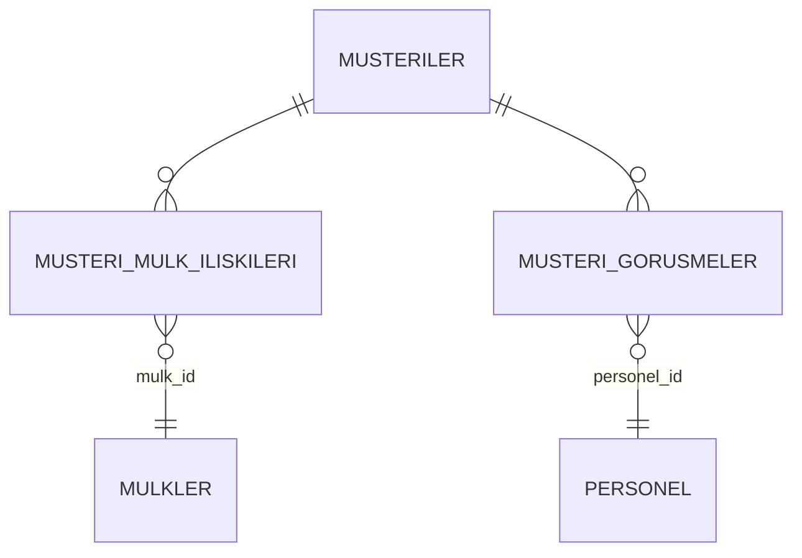

### 7. Test ve Seed
- Her tablo için örnek seed dosyası (örnek etkileşim, görüşme)
- CRUD ve ilişki yönetimi için birim testleri

### 8. Geliştirme Notları
- Müşteri detayında etkileşim ve görüşmelerin kronolojik gösterimi
- Modal pencerede detaylı görüşme tarihçesi
- Görüşme sonucuna göre müşteri durumu güncelleme
- Soft delete ile silinen kayıtlar arayüzde filtrelenebilir olmalı

---

## Talep Yönetimi Modülü - Detay Breakdown

### 1. Amaç ve Kapsam
Talep yönetimi modülü, müşterilerin aradığı mülk kriterlerini, lokasyon ve fiyat tercihlerini, satılık/kiralık durumunu ve özel isteklerini kaydetmeyi ve yönetmeyi sağlar. Müşteri talepleri, portföy eşleştirme ve bildirim süreçlerinin temelini oluşturur.

### 2. Temel Tablolar ve Alanlar

#### musteri_talepleri
- id (uuid, primary)
- musteri_id (uuid, foreign, musteriler)
- talep_tipi (enum: Satılık, Kiralık, Her İkisi)
- butce_min, butce_max (decimal, nullable)
- para_birimi (string, default 'TRY')
- tercih_edilen_mulk_turleri (json, çoklu seçim)
- tercih_edilen_sehir_id, ilce_id, semt_id, mahalle_id (uuid, foreign, nullable, çoklu seçim için json veya ayrı tablo)
- tercih_edilen_oda_sayisi_min, max (integer, nullable)
- tercih_edilen_metrekare_min, max (decimal, nullable)
- ozel_istekler (text, nullable)
- durum (enum: Aktif, Pasif, Tamamlandı, İptal)
- notlar (text, nullable)
- olusturma_tarihi, guncelleme_tarihi, silinme_tarihi (timestamp)

#### musteri_talep_ozellikleri
- id (uuid, primary)
- talep_id (uuid, foreign, musteri_talepleri)
- ozellik_id (uuid, foreign, mulk_ozellikleri)
- deger (string, nullable)
- olusturma_tarihi, guncelleme_tarihi, silinme_tarihi (timestamp)

### 3. İlişkiler
- Talep > Müşteri (her talep bir müşteriye bağlı)
- Talep > Talep Özellikleri (her talep için dinamik özellikler)
- Talep > Tercih edilen mülk türleri ve lokasyonlar (çoklu seçim, json veya ayrı pivot tablo)

### 4. Fonksiyonel Özellikler
- CRUD işlemleri (talep, talep özellikleri)
- Çoklu mülk tipi ve lokasyon seçimi
- Fiyat aralığı, oda/metrekare aralığı, özel istekler
- Satılık/kiralık tercihi
- Talep kaydedildiğinde personele bildirim
- Soft delete ve UUID desteği

### 5. Örnek Migration (Kısaltılmış)
```php
Schema::create('musteri_talepleri', function (Blueprint $table) {
    $table->uuid('id')->primary();
    $table->uuid('musteri_id');
    $table->enum('talep_tipi', ['Satılık', 'Kiralık', 'Her İkisi'])->default('Satılık');
    $table->decimal('butce_min', 15, 2)->nullable();
    $table->decimal('butce_max', 15, 2)->nullable();
    $table->string('para_birimi', 3)->default('TRY');
    $table->json('tercih_edilen_mulk_turleri')->nullable();
    $table->json('tercih_edilen_lokasyonlar')->nullable();
    $table->integer('tercih_edilen_oda_sayisi_min')->nullable();
    $table->integer('tercih_edilen_oda_sayisi_max')->nullable();
    $table->decimal('tercih_edilen_metrekare_min', 10, 2)->nullable();
    $table->decimal('tercih_edilen_metrekare_max', 10, 2)->nullable();
    $table->text('ozel_istekler')->nullable();
    $table->enum('durum', ['Aktif', 'Pasif', 'Tamamlandı', 'İptal'])->default('Aktif');
    $table->text('notlar')->nullable();
    $table->timestamp('olusturma_tarihi')->nullable();
    $table->timestamp('guncelleme_tarihi')->nullable();
    $table->timestamp('silinme_tarihi')->nullable();
    $table->foreign('musteri_id')->references('id')->on('musteriler');
});
```

### 6. ER Diyagramı (Mermaid)
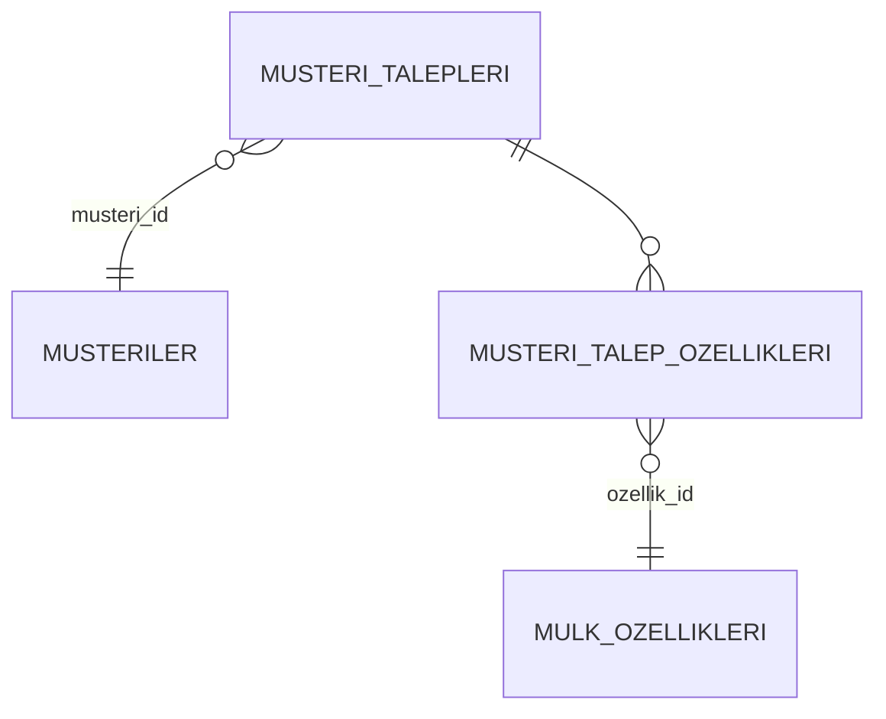

### 7. Test ve Seed
- Her tablo için örnek seed dosyası (örnek talep, talep özelliği)
- CRUD ve çoklu seçim için birim testleri

### 8. Geliştirme Notları
- Çoklu mülk tipi ve lokasyon seçimi için dinamik select bileşenleri
- Talep kaydedildiğinde ilgili personele bildirim
- Soft delete ile silinen kayıtlar arayüzde filtrelenebilir olmalı

---

## Platform Entegrasyonu ve İlan Yönetimi Modülü - Detay Breakdown

### 1. Amaç ve Kapsam
Bu modül, mülklerin farklı platformlarda (Sahibinden, Hürriyet Emlak, Hepsiemlak, Kendi Sitesi, İlansız) yayınlanmasını, ilanların durum ve bağlantı bilgilerinin yönetilmesini ve platform API entegrasyonlarını sağlar.

### 2. Temel Tablolar ve Alanlar

#### ilan_platformlari
- id (uuid, primary)
- ad (string)
- website (string, nullable)
- api_bilgileri (text, JSON, nullable)
- aciklama (text, nullable)
- aktif_mi (boolean)
- olusturma_tarihi, guncelleme_tarihi, silinme_tarihi (timestamp)

#### ilanlar
- id (uuid, primary)
- mulk_id (uuid, foreign, mulkler)
- baslik (string)
- aciklama (text)
- ilan_no (string, unique)
- ilan_tipi (enum: Satılık, Kiralık, Günlük Kiralık, Devren Satılık, Devren Kiralık)
- fiyat (decimal)
- para_birimi (string, default 'TRY')
- pazarlik_payi_var_mi (boolean)
- durum (enum: Taslak, Yayında, Yayından Kaldırıldı, Süresi Doldu, Satıldı, Kiralandı)
- yayin_baslangic_tarihi, yayin_bitis_tarihi (date, nullable)
- vitrin_mi, one_cikan_mi (boolean)
- goruntulenme_sayisi (integer)
- sorumlu_personel_id (uuid, foreign, personel, nullable)
- seo_anahtar_kelimeler, seo_aciklama (text, nullable)
- notlar (text, nullable)
- olusturma_tarihi, guncelleme_tarihi, silinme_tarihi (timestamp)

#### ilan_platform_iliskileri
- id (uuid, primary)
- ilan_id (uuid, foreign, ilanlar)
- platform_id (uuid, foreign, ilan_platformlari)
- platform_ilan_no (string, nullable)
- platform_ilan_url (string, nullable)
- durum (enum: Beklemede, Yayında, Hata, Yayından Kaldırıldı, Süresi Doldu)
- hata_mesaji (text, nullable)
- yayin_baslangic_tarihi, yayin_bitis_tarihi (date, nullable)
- goruntulenme_sayisi (integer)
- maliyet (decimal, nullable)
- para_birimi (string, default 'TRY')
- notlar (text, nullable)
- olusturma_tarihi, guncelleme_tarihi, silinme_tarihi (timestamp)
- unique: [ilan_id, platform_id]

### 3. İlişkiler
- İlan > Mülk (her ilan bir mülke bağlı)
- İlan > Sorumlu Personel
- İlan > Platform İlişkileri (her ilan birden fazla platformda olabilir)
- Platform İlişkisi > Platform

### 4. Fonksiyonel Özellikler
- CRUD işlemleri (ilan, platform, platform ilişkisi)
- Platform seçimi ve bilgi girişi (ID, link)
- Her platform için ayrı ID/link alanı
- Link tıklama ve yeni pencerede açma
- İlan durumu güncelleme
- Platform API entegrasyonları (Sahibinden, Hürriyet Emlak, Hepsiemlak)
- Soft delete ve UUID desteği

### 5. Örnek Migration (Kısaltılmış)
```php
Schema::create('ilanlar', function (Blueprint $table) {
    $table->uuid('id')->primary();
    $table->uuid('mulk_id');
    $table->string('baslik');
    $table->text('aciklama');
    $table->string('ilan_no')->unique();
    $table->enum('ilan_tipi', ['Satılık', 'Kiralık', 'Günlük Kiralık', 'Devren Satılık', 'Devren Kiralık'])->default('Satılık');
    $table->decimal('fiyat', 15, 2);
    $table->string('para_birimi', 3)->default('TRY');
    // ... diğer alanlar ...
    $table->timestamp('olusturma_tarihi')->nullable();
    $table->timestamp('guncelleme_tarihi')->nullable();
    $table->timestamp('silinme_tarihi')->nullable();
    $table->foreign('mulk_id')->references('id')->on('mulkler');
});
```

### 6. ER Diyagramı (Mermaid)
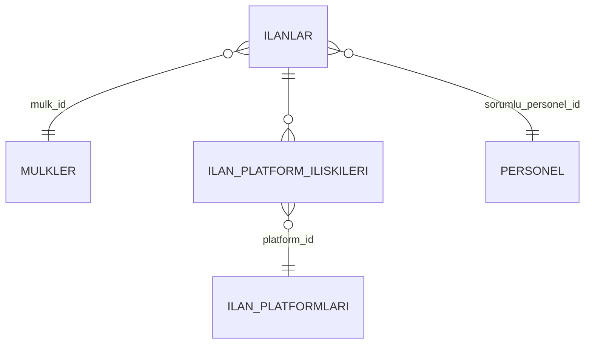

### 7. Test ve Seed
- Her tablo için örnek seed dosyası (örnek ilan, platform, platform ilişkisi)
- CRUD ve platform entegrasyonu için birim testleri

### 8. Geliştirme Notları
- Platform API entegrasyonları için ayrı servis katmanı
- Her platform için hata yönetimi ve loglama
- Link tıklama için güvenli yeni pencere açma
- Soft delete ile silinen kayıtlar arayüzde filtrelenebilir olmalı

---

## Randevu ve Takvim Yönetimi Modülü - Detay Breakdown

### 1. Amaç ve Kapsam
Bu modül, müşteri ve mülklerle ilgili tüm randevu ve takvim işlemlerinin planlanmasını, takibini ve hatırlatılmasını sağlar. Randevu süreçleri, müşteri ilişkileri ve saha operasyonları için kritik önemdedir.

### 2. Temel Tablolar ve Alanlar

#### randevu
- id (uuid, primary)
- musteri_id (uuid, foreign, musteriler, nullable)
- mulk_id (uuid, foreign, mulkler, nullable)
- personel_id (uuid, foreign, personel, nullable)
- baslik (string)
- aciklama (text, nullable)
- tarih (date)
- baslangic_saati (time)
- bitis_saati (time)
- durum (enum: Planlandı, Tamamlandı, İptal Edildi, Ertelendi)
- sonuc (text, nullable)
- musteri_geri_bildirim (text, nullable)
- sonraki_adim (text, nullable)
- sonraki_adim_tarihi (date, nullable)
- hatirlatma_dakika (integer, nullable)
- lokasyon (string, nullable)
- notlar (text, nullable)
- olusturma_tarihi, guncelleme_tarihi, silinme_tarihi (timestamp)

### 3. İlişkiler
- Randevu > Müşteri (isteğe bağlı)
- Randevu > Mülk (isteğe bağlı)
- Randevu > Personel (isteğe bağlı)

### 4. Fonksiyonel Özellikler
- CRUD işlemleri (randevu)
- Takvim görünümü (tüm randevular kronolojik ve takvimde)
- Randevu oluşturma, iptal, tamamlama, erteleme
- Randevu sonucu ve müşteri geri bildirimi kaydı
- Hatırlatma sistemi (job, e-posta, uygulama içi bildirim)
- Soft delete ve UUID desteği

### 5. Örnek Migration (Kısaltılmış)
```php
Schema::create('randevu', function (Blueprint $table) {
    $table->uuid('id')->primary();
    $table->uuid('musteri_id')->nullable();
    $table->uuid('mulk_id')->nullable();
    $table->uuid('personel_id')->nullable();
    $table->string('baslik');
    $table->text('aciklama')->nullable();
    $table->date('tarih');
    $table->time('baslangic_saati');
    $table->time('bitis_saati');
    $table->enum('durum', ['Planlandı', 'Tamamlandı', 'İptal Edildi', 'Ertelendi'])->default('Planlandı');
    $table->text('sonuc')->nullable();
    $table->text('musteri_geri_bildirim')->nullable();
    $table->text('sonraki_adim')->nullable();
    $table->date('sonraki_adim_tarihi')->nullable();
    $table->integer('hatirlatma_dakika')->nullable();
    $table->string('lokasyon')->nullable();
    $table->text('notlar')->nullable();
    $table->timestamp('olusturma_tarihi')->nullable();
    $table->timestamp('guncelleme_tarihi')->nullable();
    $table->timestamp('silinme_tarihi')->nullable();
    $table->foreign('musteri_id')->references('id')->on('musteriler');
    $table->foreign('mulk_id')->references('id')->on('mulkler');
    $table->foreign('personel_id')->references('id')->on('personel');
});
```

### 6. ER Diyagramı (Mermaid)
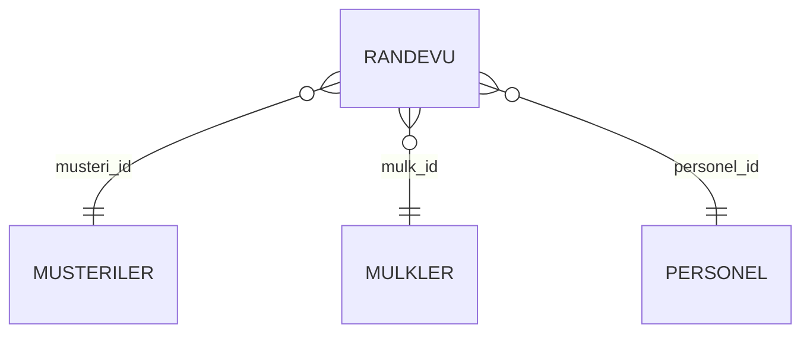

### 7. Test ve Seed
- Her tablo için örnek seed dosyası (örnek randevu)
- CRUD ve takvim görünümü için birim testleri

### 8. Geliştirme Notları
- Takvim görünümü için FullCalendar veya benzeri bir JS kütüphanesi ile entegrasyon
- Hatırlatma için queue/job ve bildirim sistemi
- Soft delete ile silinen kayıtlar arayüzde filtrelenebilir olmalı

---

## Medya, Galeri ve Dokümantasyon Modülü - Detay Breakdown

### 1. Amaç ve Kapsam
Bu modül, mülkler ve ilgili varlıklar için fotoğraf, video, doküman (tapu, imar, AutoCAD, sözleşme vb.) ve özel medya kategorilerinin yönetimini sağlar. Galeri, dokümantasyon ve medya arşivleme süreçleri bu modül üzerinden yürütülür.

### 2. Temel Tablolar ve Alanlar

#### medya_turleri
- id (uuid, primary)
- ad (string)
- mime_type (string, nullable)
- aciklama (text, nullable)
- aktif_mi (boolean)
- olusturma_tarihi, guncelleme_tarihi, silinme_tarihi (timestamp)

#### medyalar
- id (uuid, primary)
- medya_turu_id (uuid, foreign, medya_turleri)
- medyable_id, medyable_type (polimorfik ilişki: mülk, ilan, vb.)
- dosya_adi (string)
- dosya_yolu (string)
- dosya_uzantisi (string)
- mime_type (string, nullable)
- dosya_boyutu (integer, nullable)
- baslik (string, nullable)
- aciklama (text, nullable)
- ana_gorsel_mi (boolean)
- siralama (integer)
- yukleyen_id (uuid, foreign, personel, nullable)
- olusturma_tarihi, guncelleme_tarihi, silinme_tarihi (timestamp)

#### dokuman_turleri
- id (uuid, primary)
- ad (string)
- aciklama (text, nullable)
- aktif_mi (boolean)
- olusturma_tarihi, guncelleme_tarihi, silinme_tarihi (timestamp)

#### dokumanlar
- id (uuid, primary)
- dokuman_turu_id (uuid, foreign, dokuman_turleri)
- dokumanable_id, dokumanable_type (polimorfik ilişki: mülk, müşteri, vb.)
- dosya_adi (string)
- dosya_yolu (string)
- dosya_uzantisi (string)
- mime_type (string, nullable)
- dosya_boyutu (integer, nullable)
- baslik (string)
- aciklama (text, nullable)
- gecerlilik_tarihi (date, nullable)
- gizli_mi (boolean)
- yukleyen_id (uuid, foreign, personel, nullable)
- olusturma_tarihi, guncelleme_tarihi, silinme_tarihi (timestamp)

### 3. İlişkiler
- Medya > Medya Türü
- Medya > Polimorfik ilişki (mülk, ilan, müşteri, vb.)
- Medya > Yükleyen Personel
- Doküman > Doküman Türü
- Doküman > Polimorfik ilişki (mülk, müşteri, vb.)
- Doküman > Yükleyen Personel

### 4. Fonksiyonel Özellikler
- CRUD işlemleri (medya, doküman, türler)
- Galeri yönetimi (fotoğraf, video, ana görsel, sıralama)
- Dokümantasyon yönetimi (tapu, AutoCAD, PDF, DWG, DXF, sözleşme, vb.)
- Özel medya kategorileri (uydu, imar, arsa için dokümantasyon)
- Dosya arşivleme ve eski medya yönetimi
- Dosya boyutu ve format validasyonu
- Güvenli download linki
- Soft delete ve UUID desteği

### 5. Örnek Migration (Kısaltılmış)
```php
Schema::create('medyalar', function (Blueprint $table) {
    $table->uuid('id')->primary();
    $table->uuid('medya_turu_id');
    $table->morphs('medyable');
    $table->string('dosya_adi');
    $table->string('dosya_yolu');
    $table->string('dosya_uzantisi', 10);
    $table->string('mime_type')->nullable();
    $table->integer('dosya_boyutu')->nullable();
    $table->string('baslik')->nullable();
    $table->text('aciklama')->nullable();
    $table->boolean('ana_gorsel_mi')->default(false);
    $table->integer('siralama')->default(0);
    $table->uuid('yukleyen_id')->nullable();
    $table->timestamp('olusturma_tarihi')->nullable();
    $table->timestamp('guncelleme_tarihi')->nullable();
    $table->timestamp('silinme_tarihi')->nullable();
    $table->foreign('medya_turu_id')->references('id')->on('medya_turleri');
});
```

### 6. ER Diyagramı (Mermaid)
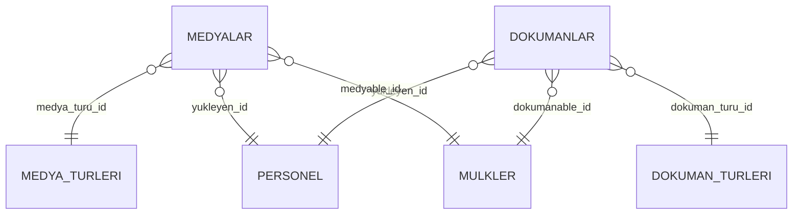

### 7. Test ve Seed
- Her tablo için örnek seed dosyası (örnek medya, doküman, türler)
- CRUD ve dosya yükleme için birim testleri

### 8. Geliştirme Notları
- Polimorfik ilişki ile medya/doküman farklı varlıklara bağlanabilmeli
- Dosya yükleme için dropzone ve preview desteği
- Arşivlenen eski medya/dokümanlar sadece yöneticiye gösterilmeli
- Soft delete ile silinen kayıtlar arayüzde filtrelenebilir olmalı

---

## Fiyat Takibi ve Analiz Modülü - Detay Breakdown

### 1. Amaç ve Kapsam
Bu modül, mülklerin fiyat geçmişinin kaydını, bölgesel fiyat analizlerini, benzer mülk karşılaştırmalarını ve fiyat anomalisi tespitini sağlar. Piyasa trendlerinin izlenmesi ve raporlanması için kullanılır.

### 2. Temel Tablolar ve Alanlar

#### fiyat_gecmisi
- id (uuid, primary)
- mulk_id (uuid, foreign, mulkler)
- eski_fiyat (decimal)
- yeni_fiyat (decimal)
- para_birimi (string)
- degisiklik_tarihi (timestamp)
- degisiklik_nedeni (string, nullable)
- personel_id (uuid, foreign, personel)
- notlar (text, nullable)
- olusturma_tarihi, guncelleme_tarihi, silinme_tarihi (timestamp)

### 3. İlişkiler
- Fiyat Geçmişi > Mülk (her fiyat kaydı bir mülke bağlı)
- Fiyat Geçmişi > Personel (değişikliği yapan)

### 4. Fonksiyonel Özellikler
- CRUD işlemleri (fiyat geçmişi)
- Fiyat güncelleme ve geçmiş kaydı
- Bölgesel fiyat trendi analizi
- Benzer mülk fiyat karşılaştırma
- Fiyat anomalisi tespiti ve uyarı
- Soft delete ve UUID desteği

### 5. Örnek Migration (Kısaltılmış)
```php
Schema::create('fiyat_gecmisi', function (Blueprint $table) {
    $table->uuid('id')->primary();
    $table->uuid('mulk_id');
    $table->decimal('eski_fiyat', 15, 2);
    $table->decimal('yeni_fiyat', 15, 2);
    $table->string('para_birimi', 10);
    $table->timestamp('degisiklik_tarihi');
    $table->string('degisiklik_nedeni')->nullable();
    $table->uuid('personel_id');
    $table->text('notlar')->nullable();
    $table->timestamp('olusturma_tarihi')->nullable();
    $table->timestamp('guncelleme_tarihi')->nullable();
    $table->timestamp('silinme_tarihi')->nullable();
    $table->foreign('mulk_id')->references('id')->on('mulkler')->onDelete('cascade');
    $table->foreign('personel_id')->references('id')->on('personel');
});
```

### 6. ER Diyagramı (Mermaid)
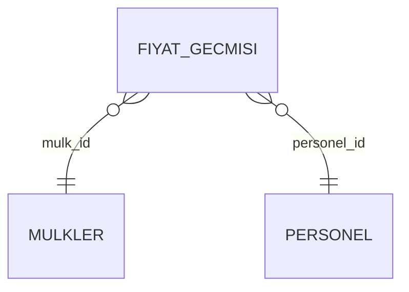

### 7. Test ve Seed
- Her tablo için örnek seed dosyası (örnek fiyat geçmişi)
- CRUD ve analiz fonksiyonları için birim testleri

### 8. Geliştirme Notları
- Fiyat güncelleme işlemi otomatik geçmiş kaydı oluşturmalı
- Bölgesel analiz ve karşılaştırma için rapor servisleri
- Fiyat anomalisi tespiti için eşik ve algoritma tanımlanmalı
- Soft delete ile silinen kayıtlar arayüzde filtrelenebilir olmalı

---

## Gelişmiş Arama ve Filtreleme Modülü - Detay Breakdown

### 1. Amaç ve Kapsam
Bu modül, portföydeki mülkler, müşteriler ve diğer varlıklar üzerinde çoklu kriterle, hızlı ve esnek arama/filtreleme yapılmasını sağlar. Harita entegrasyonu, kayıtlı arama, AI destekli öneri ve export özelliklerini kapsar.

### 2. Temel Tablolar ve Alanlar

#### kayitli_aramalar
- id (uuid, primary)
- user_id (uuid, foreign, users)
- ad (string)
- arama_kriterleri (json)
- favori_mi (boolean)
- olusturma_tarihi, guncelleme_tarihi, silinme_tarihi (timestamp)

#### arama_loglari
- id (uuid, primary)
- user_id (uuid, foreign, users)
- arama_kriterleri (json)
- sonuc_sayisi (integer)
- arama_tarihi (timestamp)

### 3. İlişkiler
- Kayıtlı Arama > User (her kayıtlı arama bir kullanıcıya bağlı)
- Arama Logu > User

### 4. Fonksiyonel Özellikler
- Çoklu kriterle arama ve filtreleme (mülk, müşteri, ilan, randevu, vb.)
- Harita üzerinde arama ve sonuç gösterimi (Google Maps API entegrasyonu)
- Kayıtlı arama oluşturma, favori olarak saklama
- AI destekli benzer mülk öneri sistemi
- Arama sonuçlarını export (PDF, XLSX, CSV)
- Soft delete ve UUID desteği

### 5. Örnek Migration (Kısaltılmış)
```php
Schema::create('kayitli_aramalar', function (Blueprint $table) {
    $table->uuid('id')->primary();
    $table->uuid('user_id');
    $table->string('ad');
    $table->json('arama_kriterleri');
    $table->boolean('favori_mi')->default(false);
    $table->timestamp('olusturma_tarihi')->nullable();
    $table->timestamp('guncelleme_tarihi')->nullable();
    $table->timestamp('silinme_tarihi')->nullable();
    $table->foreign('user_id')->references('id')->on('users');
});
```

### 6. ER Diyagramı (Mermaid)
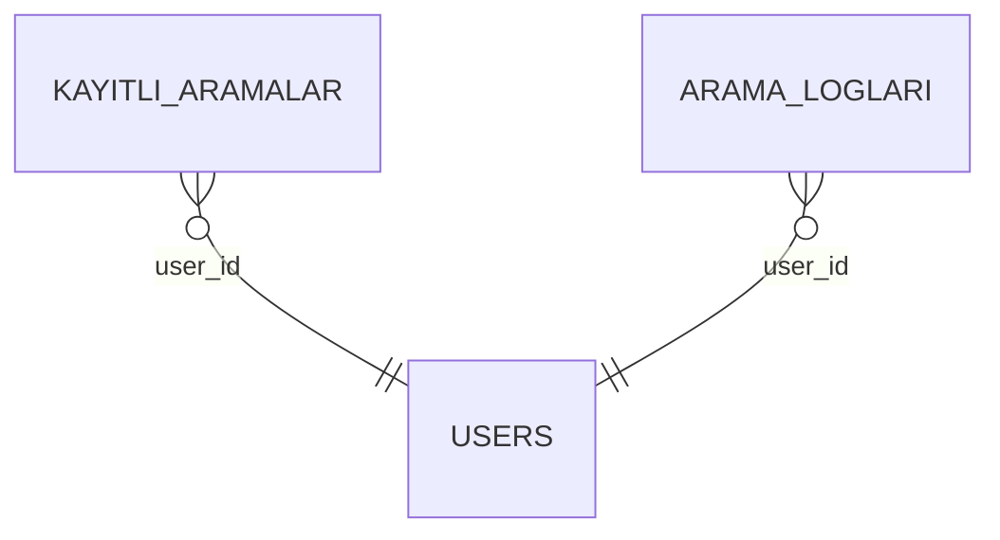

### 7. Test ve Seed
- Her tablo için örnek seed dosyası (örnek kayıtlı arama, arama logu)
- Çoklu kriter arama ve export için birim testleri

### 8. Geliştirme Notları
- Arama kriterleri json olarak saklanmalı, dinamik filtreleme için uygun olmalı
- Harita entegrasyonu için Google Maps veya benzeri API kullanılmalı
- AI öneri sistemi için ayrı servis katmanı
- Export işlemleri için queue/job desteği
- Soft delete ile silinen kayıtlar arayüzde filtrelenebilir olmalı

---

## Raporlama ve Export Modülü - Detay Breakdown

### 1. Amaç ve Kapsam
Bu modül, portföy, müşteri, mülk, ilan, randevu ve diğer verilerin farklı formatlarda (PDF, XLSX, CSV) dışa aktarılmasını ve raporlanmasını sağlar. Sunum dosyası oluşturma, toplu export ve profesyonel raporlar bu modülün kapsamındadır.

### 2. Temel Tablolar ve Alanlar

#### export_loglari
- id (uuid, primary)
- user_id (uuid, foreign, users)
- export_tipi (string)
- export_kriterleri (json)
- dosya_yolu (string)
- format (enum: PDF, XLSX, CSV)
- kayit_sayisi (integer)
- export_tarihi (timestamp)
- durum (enum: Başarılı, Hata, Beklemede)
- hata_mesaji (text, nullable)
- olusturma_tarihi, guncelleme_tarihi, silinme_tarihi (timestamp)

### 3. İlişkiler
- Export Logu > User (her export işlemi bir kullanıcıya bağlı)

### 4. Fonksiyonel Özellikler
- PDF, XLSX, CSV ve diğer formatlarda export
- Portföy, mülk, müşteri, ilan, randevu, rapor exportu
- Tek mülk için profesyonel sunum dosyası oluşturma
- Toplu sunum oluşturma (birden fazla mülkü tek dosyada birleştirme)
- Export işlemi tamamlandığında indirme linki ve bildirim
- Export işlemleri için queue/job desteği
- Soft delete ve UUID desteği

### 5. Örnek Migration (Kısaltılmış)
```php
Schema::create('export_loglari', function (Blueprint $table) {
    $table->uuid('id')->primary();
    $table->uuid('user_id');
    $table->string('export_tipi');
    $table->json('export_kriterleri');
    $table->string('dosya_yolu');
    $table->enum('format', ['PDF', 'XLSX', 'CSV']);
    $table->integer('kayit_sayisi');
    $table->timestamp('export_tarihi');
    $table->enum('durum', ['Başarılı', 'Hata', 'Beklemede'])->default('Beklemede');
    $table->text('hata_mesaji')->nullable();
    $table->timestamp('olusturma_tarihi')->nullable();
    $table->timestamp('guncelleme_tarihi')->nullable();
    $table->timestamp('silinme_tarihi')->nullable();
    $table->foreign('user_id')->references('id')->on('users');
});
```

### 6. ER Diyagramı (Mermaid)
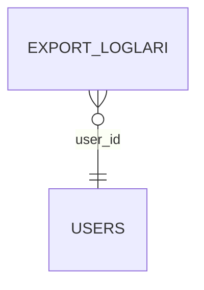

### 7. Test ve Seed
- Her tablo için örnek seed dosyası (örnek export logu)
- Export ve raporlama fonksiyonları için birim testleri

### 8. Geliştirme Notları
- Export işlemleri için queue/job ve bildirim sistemi
- Sunum dosyası için özel şablonlar ve PDF render desteği
- Export edilen dosyalar için güvenli indirme linki
- Soft delete ile silinen kayıtlar arayüzde filtrelenebilir olmalı

---

## Dashboard ve İstatistik Modülü - Detay Breakdown

### 1. Amaç ve Kapsam
Bu modül, sistemdeki genel ve bireysel performans metriklerini, satış/kiralama istatistiklerini, bölgesel analizleri, zaman bazlı raporları ve finansal (komisyon) raporları görsel olarak sunar. Yöneticiler ve personel için karar destek sağlar.

### 2. Temel Tablolar ve Alanlar

#### dashboard_gosterge_loglari
- id (uuid, primary)
- user_id (uuid, foreign, users)
- gosterge_tipi (string)
- deger (decimal)
- tarih (date)
- filtre_kriterleri (json, nullable)
- olusturma_tarihi, guncelleme_tarihi, silinme_tarihi (timestamp)

#### komisyon_raporlari
- id (uuid, primary)
- personel_id (uuid, foreign, personel)
- toplam_satis (decimal)
- toplam_kiralama (decimal)
- toplam_komisyon (decimal)
- rapor_donemi_baslangic (date)
- rapor_donemi_bitis (date)
- olusturma_tarihi, guncelleme_tarihi, silinme_tarihi (timestamp)

### 3. İlişkiler
- Dashboard Gösterge Logu > User
- Komisyon Raporu > Personel

### 4. Fonksiyonel Özellikler
- Genel performans metrikleri (toplam satış, toplam kiralama, aktif mülk, müşteri sayısı, vb.)
- Bireysel satış/kiralama istatistikleri
- Bölgesel analiz (şehir, ilçe, semt bazında)
- Zaman dilimi seçimiyle detaylı raporlar
- Komisyon hesaplama ve finansal raporlar
- Grafik ve görsel dashboard bileşenleri (chart, card, table)
- Soft delete ve UUID desteği

### 5. Örnek Migration (Kısaltılmış)
```php
Schema::create('komisyon_raporlari', function (Blueprint $table) {
    $table->uuid('id')->primary();
    $table->uuid('personel_id');
    $table->decimal('toplam_satis', 15, 2)->default(0);
    $table->decimal('toplam_kiralama', 15, 2)->default(0);
    $table->decimal('toplam_komisyon', 15, 2)->default(0);
    $table->date('rapor_donemi_baslangic');
    $table->date('rapor_donemi_bitis');
    $table->timestamp('olusturma_tarihi')->nullable();
    $table->timestamp('guncelleme_tarihi')->nullable();
    $table->timestamp('silinme_tarihi')->nullable();
    $table->foreign('personel_id')->references('id')->on('personel');
});
```

### 6. ER Diyagramı (Mermaid)
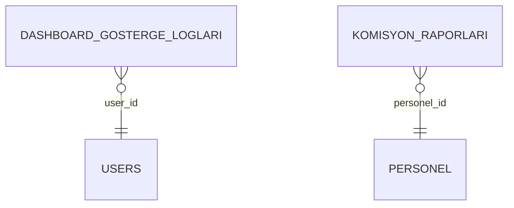

### 7. Test ve Seed
- Her tablo için örnek seed dosyası (örnek gösterge logu, komisyon raporu)
- Dashboard ve rapor fonksiyonları için birim testleri

### 8. Geliştirme Notları
- Dashboard için chart.js, apexcharts veya benzeri JS kütüphanesi ile entegrasyon
- Raporlar için filtreleme ve zaman aralığı seçimi
- Komisyon hesaplama için oran ve kural yönetimi
- Soft delete ile silinen kayıtlar arayüzde filtrelenebilir olmalı

---

## Mobil Uyumluluk ve PWA Modülü - Detay Breakdown

### 1. Amaç ve Kapsam
Bu modül, sistemin mobil cihazlarda sorunsuz çalışmasını, offline desteğini, kamera/GPS entegrasyonunu ve PWA (Progressive Web App) özelliklerini sağlar. Sahada çalışan personel için mobil deneyimi optimize eder.

### 2. Temel Özellikler ve Yapılar

#### Responsive Tasarım
- Tüm sayfalar TailwindCSS ile responsive
- Mobil menü, dokunmatik uyumlu butonlar, swipe desteği
- Mobilde optimize edilmiş form ve tablo bileşenleri

#### Kamera ve GPS Entegrasyonu
- Mobil cihazdan doğrudan fotoğraf çekip yükleme (input type="file" accept="image/*" capture)
- GPS ile konum kaydı (navigator.geolocation)
- Fotoğraf ve konumun mülk/medya kaydına eklenmesi

#### Offline Çalışma ve Senkronizasyon
- Service Worker ile offline veri saklama (IndexedDB/localStorage)
- Bağlantı tekrar sağlandığında otomatik senkronizasyon
- Offline modda yapılan işlemlerin kuyruklanması

#### PWA Özellikleri
- Manifest.json ile uygulama simgesi, splash screen, başlatıcı
- Service Worker ile cache ve push notification desteği
- Ana ekrana ekle (Add to Home Screen)
- Push bildirim entegrasyonu (ör. Firebase Cloud Messaging)

### 3. İlişkiler
- Medya yükleme, randevu, müşteri güncelleme gibi işlemler mobilde offline destekli
- GPS ve kamera verisi mülk, randevu, müşteri ile ilişkili kayıtlara eklenir

### 4. Fonksiyonel Özellikler
- Mobilde tüm formlar ve listeler dokunmatik uyumlu
- Kamera ile çekilen fotoğraf doğrudan yüklenebilir
- GPS ile konum kaydı yapılabilir
- Offline modda veri kaydı ve senkronizasyon
- PWA ile push bildirim ve ana ekrana ekleme

### 5. Örnek Kod ve Yapı
```js
// Kamera ile fotoğraf çekme (input)
<input type="file" accept="image/*" capture="environment">

// GPS ile konum kaydı
navigator.geolocation.getCurrentPosition(function(position) {
  const lat = position.coords.latitude;
  const lng = position.coords.longitude;
  // ...
});

// Service Worker kaydı
if ('serviceWorker' in navigator) {
  navigator.serviceWorker.register('/service-worker.js');
}
```

### 6. ER Diyagramı (Mobil/PWA ile ilgili varlıklar)
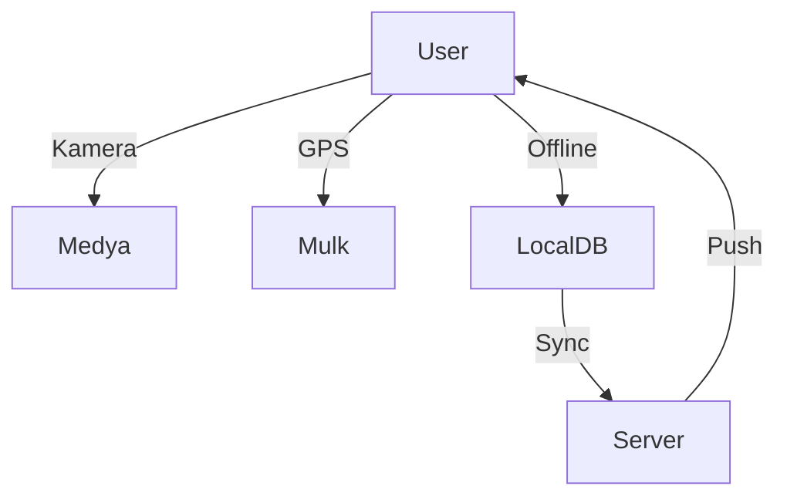

### 7. Test ve Seed
- Mobilde responsive ve offline testler (Lighthouse, Chrome DevTools)
- Kamera/GPS entegrasyonu için demo sayfaları
- PWA manifest ve service worker testleri

### 8. Geliştirme Notları
- Tüm yeni bileşenler mobile-first ve offline-first olarak tasarlanmalı
- PWA için manifest.json ve service worker dosyaları ayrı olarak yönetilmeli
- Push bildirim için FCM veya benzeri servis kullanılmalı
- Mobilde dosya boyutu ve performans optimizasyonu öncelikli

---

## Layout ve Navigasyon Modülü - Detay Breakdown

### 1. Amaç ve Kapsam
Bu modül, uygulamanın genel görünümünü, menü yapısını, sidebar ve üst menü navigasyonunu, kullanıcı tercihlerinin saklanmasını ve responsive navigasyon deneyimini sağlar.

### 2. Temel Özellikler ve Yapılar

#### Sidebar Navigasyon
- Sidebar menüsü (gizlenebilir/gösterilebilir)
- Menü grupları ve alt menüler
- Aktif menü vurgusu
- Sidebar kapalıyken ana içerik alanı genişler

#### Üst Menü ve Mobil Menü
- Üst menüde kullanıcı, bildirim, ayarlar, çıkış
- Mobilde hamburger menü ve açılır navigasyon
- Responsive menü geçişleri

#### Kullanıcı Tercihleri
- Sidebar açık/kapalı durumu localStorage veya user preferences tablosunda saklanır
- Son kullanılan menü, tema, dil tercihi

#### Responsive Tasarım
- Tüm navigasyon bileşenleri mobil/tablet/desktop uyumlu
- TailwindCSS ile grid ve flex tabanlı layout

### 3. Temel Tablolar ve Alanlar

#### user_preferences (isteğe bağlı)
- id (uuid, primary)
- user_id (uuid, foreign, users)
- sidebar_acik_mi (boolean)
- tema (string, nullable)
- dil (string, nullable)
- son_kullanilan_menu (string, nullable)
- olusturma_tarihi, guncelleme_tarihi, silinme_tarihi (timestamp)

### 4. İlişkiler
- User Preferences > User (her tercih bir kullanıcıya bağlı)

### 5. Fonksiyonel Özellikler
- Sidebar aç/kapa, menü genişlet/daralt
- Kullanıcı tercihlerinin otomatik hatırlanması
- Responsive navigasyon (mobilde swipe, hamburger menü)
- Tema ve dil tercihi desteği
- Soft delete ve UUID desteği

### 6. Örnek Kod ve Yapı
```blade
<!-- Sidebar örneği -->
<aside x-data="{ open: $persist(true) }" :class="open ? 'w-64' : 'w-16'">
    <!-- Menü içerikleri -->
</aside>

<!-- Üst menü örneği -->
<nav class="flex items-center justify-between">
    <button @click="open = !open">☰</button>
    <div class="flex items-center">@include('partials.user-menu')</div>
</nav>
```

### 7. ER Diyagramı (Mermaid)
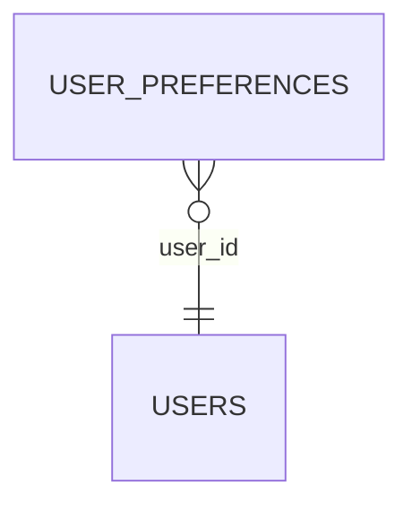

### 8. Test ve Seed
- Sidebar ve menü için birim ve entegrasyon testleri
- Kullanıcı tercihi seed ve testleri
- Responsive ve mobil menü testleri

### 9. Geliştirme Notları
- Sidebar ve menü bileşenleri Blade/Alpine.js ile dinamik olmalı
- Kullanıcı tercihi localStorage ve/veya backend ile senkronize edilmeli
- Tema ve dil desteği için context/provider yapısı kullanılabilir
- Soft delete ile silinen kayıtlar arayüzde filtrelenebilir olmalı

---

## Test, Optimizasyon ve Performans Modülü - Detay Breakdown

### 1. Amaç ve Kapsam
Bu modül, sistemin güvenilirliğini, hızını ve ölçeklenebilirliğini sağlamak için birim, entegrasyon ve fonksiyonel testlerin yazılmasını, veritabanı ve frontend optimizasyonunu, önbellek stratejilerini ve hata/log izleme altyapısını kapsar.

### 2. Temel Yapılar ve Alanlar

#### Testler
- Birim testleri (model, servis, helper, Livewire component)
- Entegrasyon testleri (controller, API endpoint, workflow)
- Fonksiyonel testler (kullanıcı akışları, edge case)
- Test veritabanı ve seed dosyaları

#### Optimizasyon
- Veritabanı indeksleri ve query optimizasyonu
- Eager loading, cache, pagination
- Frontend asset minifikasyonu, lazy loading, code splitting
- Service worker ile asset cache (PWA)

#### Önbellek ve Queue
- Laravel cache (Redis, Memcached, file)
- Sayfa ve veri önbelleği
- Queue/job altyapısı (bildirim, export, rapor, senkronizasyon)

#### Hata ve Log İzleme
- Sentry, Bugsnag veya benzeri servis entegrasyonu
- Uygulama logları, hata logları, kritik olay logları
- Log retention ve arşivleme

### 3. Temel Tablolar ve Alanlar (Opsiyonel)

#### job_loglari
- id (uuid, primary)
- job_tipi (string)
- payload (json)
- durum (enum: Başarılı, Hata, Beklemede)
- hata_mesaji (text, nullable)
- baslangic_tarihi, bitis_tarihi (timestamp)
- olusturma_tarihi, guncelleme_tarihi, silinme_tarihi (timestamp)

#### cache_loglari
- id (uuid, primary)
- cache_key (string)
- cache_tipi (string)
- cache_suresi (integer)
- olusturma_tarihi, silinme_tarihi (timestamp)

### 4. Fonksiyonel Özellikler
- Tüm modüller için otomatik ve manuel testler
- Veritabanı ve frontend performans ölçümleri
- Otomatik cache invalidation ve refresh
- Queue/job başarısı ve hata takibi
- Hata ve log izleme dashboardu

### 5. Örnek Kod ve Yapı
```php
// PHPUnit birim testi örneği
public function test_mulk_model_creates_with_uuid()
{
    $mulk = Mulk::factory()->create();
    $this->assertIsString($mulk->id);
    $this->assertTrue(Str::isUuid($mulk->id));
}

// Laravel cache kullanımı
Cache::put('mulk_listesi', $mulkler, 3600);

// Queue job dispatch
ExportJob::dispatch($params);
```

### 6. ER Diyagramı (Test/Log/Cache ile ilgili varlıklar)
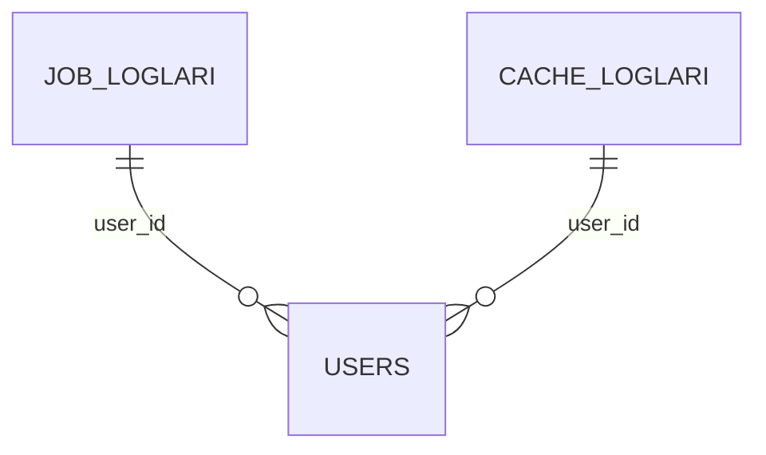

### 7. Test ve Seed
- Tüm modüller için test coverage raporu
- Test seed ve demo verileri
- Performans ve cache testleri

### 8. Geliştirme Notları
- CI/CD pipeline ile otomatik test ve deploy
- Test coverage %80+ hedeflenmeli
- Performans bottleneck noktaları için profiler kullanımı
- Hata ve log izleme için merkezi dashboard
- Soft delete ile silinen kayıtlar arayüzde filtrelenebilir olmalı

---

## Spatie Laravel Permission Entegrasyonu ve Model Override - Detay Breakdown

### 1. Amaç ve Kapsam
Rol ve yetki yönetimi için Spatie Laravel Permission paketinin UUID ve Türkçe timestamp destekli, özelleştirilmiş model ve migration yapısıyla entegre edilmesi. Tüm kullanıcı, rol, yetki ve organizasyon altyapısının temelini oluşturur.

### 2. Sıralamadaki Yeri
- Temel Sistem Altyapısı
- BaseModel ve Ortak Özellikler
- **Spatie Laravel Permission Entegrasyonu ve Model Override** ← (Bu adım)
- Kullanıcı, Yetki ve Organizasyon Yönetimi
- Diğer modüller...

### 3. Temel Tablolar ve Alanlar

#### roller (roles)
- id (uuid, primary)
- name (string)
- guard_name (string)
- olusturma_tarihi, guncelleme_tarihi, silinme_tarihi (timestamp)

#### izinler (permissions)
- id (uuid, primary)
- name (string)
- guard_name (string)
- olusturma_tarihi, guncelleme_tarihi, silinme_tarihi (timestamp)

#### model_has_roles, model_has_permissions, role_has_permissions
- id (uuid, primary, opsiyonel)
- model_type (string)
- model_id (uuid)
- role_id / permission_id (uuid)
- guard_name (string, nullable)

### 4. Fonksiyonel Özellikler
- Spatie paketinin kurulumu ve publish
- Role ve Permission modellerinin `App\Models` altına taşınması
- UUID primary key, Türkçe timestamp (olusturma_tarihi, guncelleme_tarihi, silinme_tarihi)
- Migration dosyalarının override edilmesi (id: uuid, timestamplar Türkçe)
- Pivot tabloların uuid ile oluşturulması
- Spatie config (`config/permission.php`) dosyasında model ve tablo isimlerinin güncellenmesi
- Test: Rol ve yetki atama, UUID ile ilişki, timestamp kontrolü

### 5. Örnek Model
```php
namespace App\Models;

use Spatie\Permission\Models\Role as SpatieRole;
use App\Models\BaseModel;
use Illuminate\Database\Eloquent\SoftDeletes;

class Role extends SpatieRole
{
    use SoftDeletes;
    protected $table = 'roller';
    public $incrementing = false;
    protected $keyType = 'string';

    const CREATED_AT = 'olusturma_tarihi';
    const UPDATED_AT = 'guncelleme_tarihi';
    const DELETED_AT = 'silinme_tarihi';
}
```

### 6. Örnek Migration
```php
Schema::create('roller', function (Blueprint $table) {
    $table->uuid('id')->primary();
    $table->string('name');
    $table->string('guard_name');
    $table->timestamp('olusturma_tarihi')->nullable();
    $table->timestamp('guncelleme_tarihi')->nullable();
    $table->timestamp('silinme_tarihi')->nullable();
});

Schema::create('izinler', function (Blueprint $table) {
    $table->uuid('id')->primary();
    $table->string('name');
    $table->string('guard_name');
    $table->timestamp('olusturma_tarihi')->nullable();
    $table->timestamp('guncelleme_tarihi')->nullable();
    $table->timestamp('silinme_tarihi')->nullable();
});
```

### 7. Spatie Config Ayarları
- `config/permission.php` dosyasında model ve tablo isimleri güncellenmeli:
```php
'models' => [
    'permission' => App\Models\Permission::class,
    'role' => App\Models\Role::class,
],
'table_names' => [
    'roles' => 'roller',
    'permissions' => 'izinler',
    // ... diğer tablolar ...
],
'column_names' => [
    'model_morph_key' => 'model_id',
],
'uuid' => true,
```

### 8. Test ve Seed
- UUID ile rol/izin atama ve sorgulama testleri
- Türkçe timestamp alanlarının doğru çalıştığı testler
- Kullanıcıya rol/izin atama ve sorgulama

### 9. Geliştirme Notları
- Spatie migration ve model override işlemi en başta yapılmalı
- Tüm kullanıcı, rol, yetki ve organizasyon modülleri bu yapıya bağlı olacak
- Sonradan değiştirmek migration ve veri kaybı riski doğurur
- Soft delete ile silinen kayıtlar arayüzde filtrelenebilir olmalı

---

## Ek Modüller ve Bileşenler - Detay Breakdown

### 1. Bildirim ve Mesajlaşma Modülü
**Amaç:** Sistem içi bildirimler, e-posta, SMS, push notification, uygulama içi mesajlaşma.
**Tablolar:**
- bildirimler (id, user_id, tip, mesaj, okundu_mu, gonderim_tarihi, okuma_tarihi, kanal, ilgili_kayit_id, olusturma_tarihi)
- mesajlar (id, gonderen_id, alici_id, konu, mesaj, okundu_mu, olusturma_tarihi)
**Fonksiyonel Özellikler:**
- Otomatik ve manuel bildirim gönderimi (randevu, onay, yeni kayıt, hata, vs.)
- Okundu/okunmadı takibi, bildirim ayarları
- Uygulama içi mesajlaşma, e-posta/SMS/push entegrasyonu
**Geliştirme Notları:**
- Laravel Notification, FCM, Twilio, Mailgun entegrasyonu önerilir

---

### 2. Audit Log ve Sistem İzleme
**Amaç:** Tüm önemli işlemlerin detaylı loglanması, KVKK ve güvenlik için zorunlu.
**Tablolar:**
- audit_log (id, user_id, model, model_id, islem, eski_deger, yeni_deger, ip, user_agent, olusturma_tarihi)
**Fonksiyonel Özellikler:**
- CRUD, login, yetki değişikliği, kritik veri güncelleme logları
- Log arayüzü, filtreleme, arşivleme
**Geliştirme Notları:**
- Laravel Auditing, custom observer, log retention

---

### 3. KVKK ve Yasal Onay Yönetimi
**Amaç:** Kullanıcıların KVKK, gizlilik, çerez ve sözleşme onaylarını saklamak.
**Tablolar:**
- yasal_onaylar (id, user_id, onay_tipi, metin_versiyon, onay_tarihi, ip, user_agent)
**Fonksiyonel Özellikler:**
- Onay metni versiyonlama, zorunlu onay kutuları
- Kullanıcı onay geçmişi
**Geliştirme Notları:**
- Onaylar ilk girişte ve profilde alınmalı

---

### 4. Çoklu Dil (i18n) ve Yerelleştirme
**Amaç:** Sistemin farklı dillere çevrilebilmesi.
**Bileşenler:**
- lang/ dizini, dil dosyaları
- kullanıcı_dil_tercihi (user_id, dil)
**Fonksiyonel Özellikler:**
- Dinamik çeviri, dil seçici, kullanıcı bazlı dil
**Geliştirme Notları:**
- Laravel localization, trans(), @lang, JSON dil dosyaları

---

### 5. API ve Dış Servis Entegrasyonları
**Amaç:** Mobil uygulama, 3. parti entegrasyonlar, webhook, REST/GraphQL API.
**Bileşenler:**
- api_tokens (id, user_id, token, scope, son_kullanim, olusturma_tarihi)
- webhook_log (id, endpoint, payload, response, durum, tarih)
**Fonksiyonel Özellikler:**
- API authentication, rate limit, API log, webhook yönetimi
**Geliştirme Notları:**
- Laravel Passport/Sanctum, GraphQL, Swagger/OpenAPI

---

### 6. Dosya ve Medya Arşivleme/Versiyonlama
**Amaç:** Yüklenen dosya ve medyaların eski versiyonlarının saklanması.
**Tablolar:**
- dosya_arsiv (id, orijinal_id, dosya_yolu, versiyon, yukleyen_id, tarih)
**Fonksiyonel Özellikler:**
- Eski dosya erişimi, arşivden geri alma
**Geliştirme Notları:**
- Dosya güncellemede otomatik arşiv

---

### 7. Geliştirici ve API Dokümantasyonu
**Amaç:** Kod ve API endpoint'lerinin otomatik veya manuel dokümantasyonu.
**Bileşenler:**
- Swagger/OpenAPI, Postman collection, inline kod dokümantasyonu
**Fonksiyonel Özellikler:**
- API explorer, endpoint test, örnek istek/yanıt
**Geliştirme Notları:**
- L5-Swagger, Scribe, PHPDoc

---

### 8. Yetki ve Onay Akışları (Workflow)
**Amaç:** Çok adımlı onay süreçleri (ör. mülk yayına alma, fiyat değişikliği).
**Tablolar:**
- onay_akislari (id, model, model_id, adim, onaylayan_id, durum, onay_tarihi, not)
**Fonksiyonel Özellikler:**
- Çoklu onaycı, onay bekleyenler listesi, audit trail
**Geliştirme Notları:**
- State machine, event/saga pattern

---

### 9. Kullanıcı Davranış ve Analitik
**Amaç:** Kullanıcıların sistemdeki hareketlerinin izlenmesi, analitik dashboard.
**Tablolar:**
- analitik_event (id, user_id, event, detay, tarih)
**Fonksiyonel Özellikler:**
- Tıklama, ziyaret, ısı haritası, popüler sayfa/özellik
**Geliştirme Notları:**
- Google Analytics, Matomo, custom event tracking

---

### 10. Sıkça Sorulan Sorular (SSS) ve Yardım Merkezi
**Amaç:** Kullanıcıların sıkça karşılaştığı sorunlara hızlı çözüm sunmak.
**Tablolar:**
- sss (id, kategori, soru, cevap, aktif_mi, olusturma_tarihi)
- yardim_talepleri (id, user_id, konu, mesaj, durum, yanit, olusturma_tarihi)
**Fonksiyonel Özellikler:**
- SSS arama, kategori, yardım talebi oluşturma
**Geliştirme Notları:**
- SSS yönetim arayüzü, otomatik yanıt

---

### 11. Demo/Seed Data Yönetimi
**Amaç:** Geliştirme ve test ortamı için kolayca örnek veri yükleme/temizleme.
**Bileşenler:**
- Seed scriptleri, demo veri yönetim arayüzü
**Fonksiyonel Özellikler:**
- Demo veri yükle/temizle, test senaryoları
**Geliştirme Notları:**
- Laravel seeder, factory, artisan komutları

---

### 12. Sistem Sağlık ve Bakım Modülü
**Amaç:** Sistem bakımda/kapalıyken kullanıcıya bilgi vermek, sağlık kontrolleri.
**Bileşenler:**
- bakım_modu (aktif_mi, mesaj, baslangic, bitis)
- health_check endpoint
**Fonksiyonel Özellikler:**
- Bakım ekranı, uptime izleme, sağlık raporu
**Geliştirme Notları:**
- Laravel health, custom middleware

---

### 13. Sözleşme Otomasyonu
**Amaç:** Otomatik sözleşme oluşturma, imzalama, PDF çıktısı.
**Tablolar:**
- sozlesmeler (id, musteri_id, mulk_id, tip, metin, imza, pdf_yolu, tarih)
**Fonksiyonel Özellikler:**
- Sözleşme şablonları, otomatik doldurma, e-imza, PDF export
**Geliştirme Notları:**
- DomPDF, TCPDF, imza pad entegrasyonu

---

### 14. Takvim Entegrasyonu
**Amaç:** Google Calendar, Outlook gibi harici takvimlerle entegrasyon.
**Bileşenler:**
- calendar_sync (id, user_id, provider, token, son_sync, durum)
**Fonksiyonel Özellikler:**
- Randevu senkronizasyonu, çift yönlü güncelleme
**Geliştirme Notları:**
- Google Calendar API, Outlook API

---

### 15. Kullanıcıya Özel Dashboard
**Amaç:** Rol bazlı farklı dashboard görünümleri.
**Bileşenler:**
- dashboard_layouts (id, user_id, layout_json, aktif_mi)
**Fonksiyonel Özellikler:**
- Widget ekle/çıkar, rol bazlı görünüm
**Geliştirme Notları:**
- Dynamic dashboard builder

---

### 16. Gelişmiş Yetki Matrisi
**Amaç:** Alan, satır, aksiyon bazlı yetkilendirme.
**Bileşenler:**
- yetki_matrisi (id, role_id, model, alan, aksiyon, izin)
**Fonksiyonel Özellikler:**
- Granüler yetki kontrolü, özel policy
**Geliştirme Notları:**
- Custom policy, Spatie permission extension

---

### 17. Kullanıcıya Özel Bildirim Ayarları
**Amaç:** Hangi bildirimleri almak istediğini seçebilme.
**Bileşenler:**
- bildirim_ayar (id, user_id, tip, kanal, aktif_mi)
**Fonksiyonel Özellikler:**
- Bildirim tercih ekranı, kanal bazlı ayar
**Geliştirme Notları:**
- Notification preferences UI

---

> **Tebrikler!** Tüm modüller için detay breakdown, tablo şeması, ilişkiler, örnek migration/kod ve ER diyagramı README.md dosyana eklendi. Proje dokümantasyonun artık uçtan uca hazır. Yeni modül veya ek detay istersen, modül adını belirtmen yeterli!